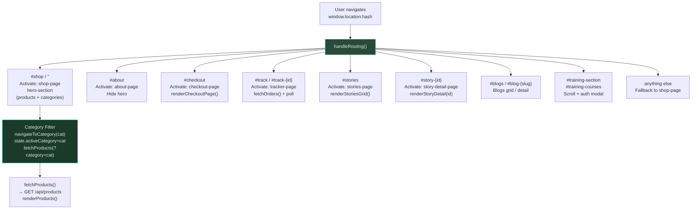
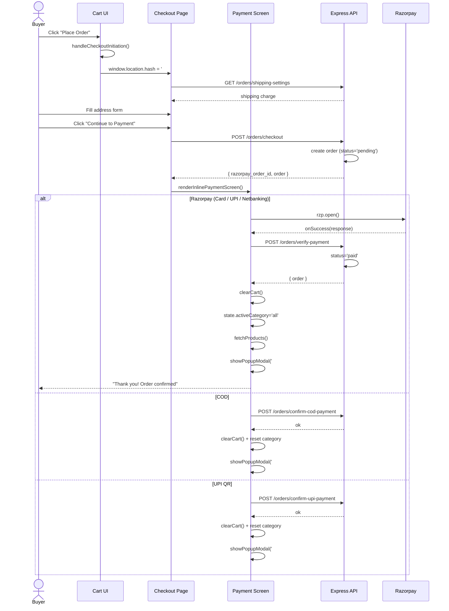
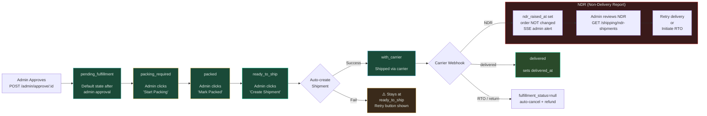
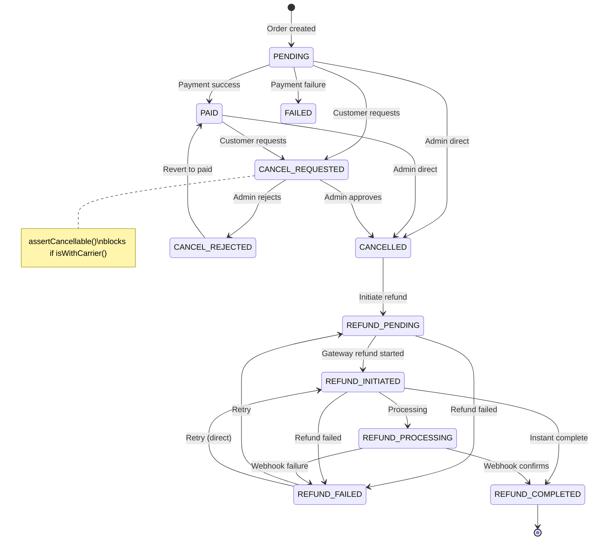
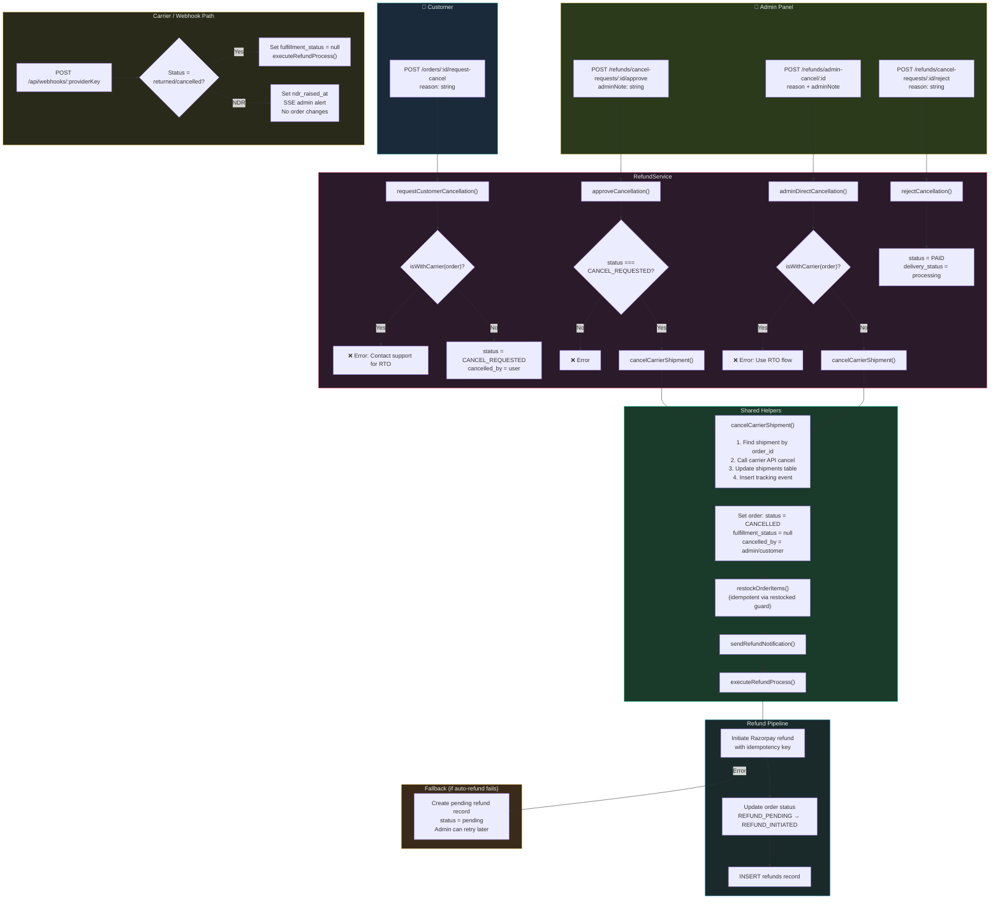
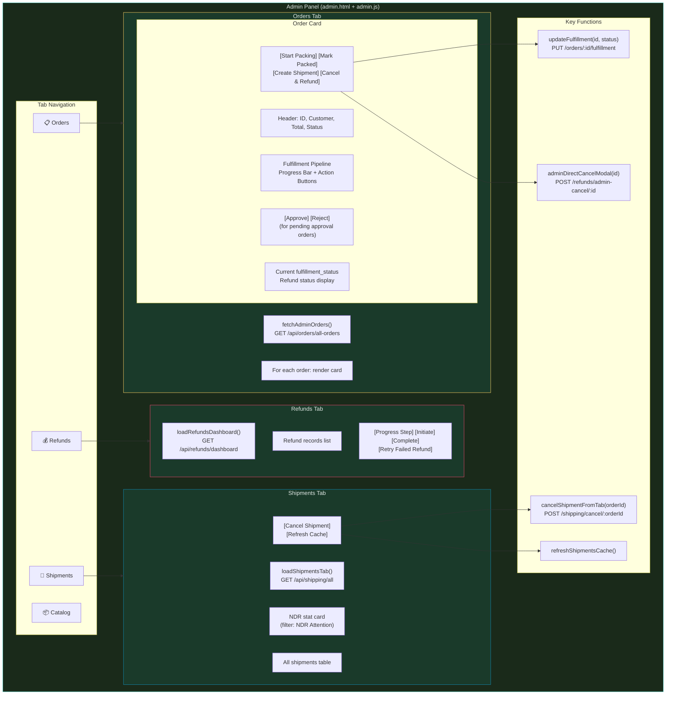
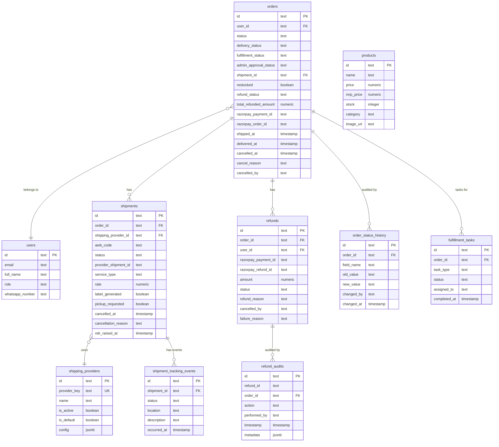
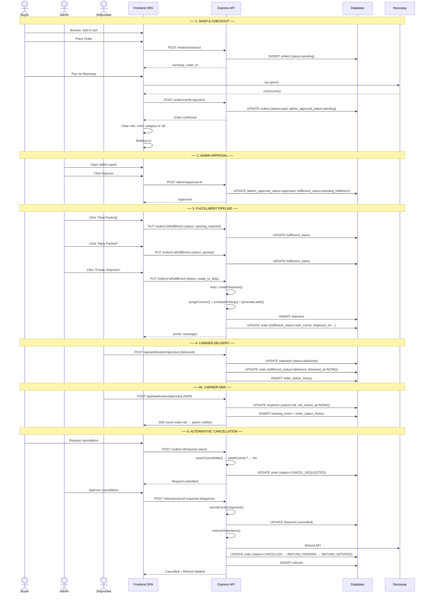

# 🍄 Sporekart — Application Flow Diagrams

> Complete system architecture, routing, state machines & data flows  
> Generated from codebase analysis — Last updated: June 29, 2026

---

## 1. System Architecture Overview

High-level view of frontend, backend, database, and external service integration.

```mermaid
graph TB
    subgraph BROWSER["🌐 Browser SPA"]
        APP["app.js\nHash Router"] 
        ADMIN["admin.html\nadmin.js Panel"]
        CSS["style.css\nadmin-premium.css"]
    end
    
    subgraph BACKEND["⚙️ Express.js Server (server.js)"]
        MIDDLEWARE["Middleware\nauthMiddleware\nvalidateBody\nrateLimit"]
        
        subgraph ROUTES["API Routes"]
            ORDERS["/api/orders\ncheckout, fulfillment\ncancel, track"]
            REFUNDS["/api/refunds\ncancel requests\nrefund management"]
            SHIPPING["/api/shipping\ncreate, track\ncancel shipment, NDR"]
            WEBHOOKS["/api/webhooks\ncarrier events"]
            AUTH["/api/auth\nlogin, OTP, profile"]
            PRODUCTS["/api/products"]
            CATEGORIES["/api/categories"]
            BLOGS["/api/blogs"]
            TRAININGS["/api/trainings"]
        end
        
        subgraph MODULES["Business Logic"]
            REFUND_SVC["RefundService\ncancelCarrierShipment\nexecuteRefundProcess\napproveCancellation"]
            ORDER_SVC["OrderStateService\nstate machine\nrestockOrderItems\nisWithCarrier"]
            PAYMENT_SVC["PaymentService\nRazorpay integration\nidempotency keys"]
            AUDIT_SVC["RefundAuditService\nimmutable audit logs"]
        end
        
        subgraph SERVICES["Service Layer"]
            NOTIFY["notificationService\nEmail + SMS + WhatsApp"]
            SHIP_PROV["shipping/ProviderRegistry\nShiprocketAdapter"]
            AUTH_SVC["authService\nJWT + OTP"]
        end
        
        subgraph CONFIG["Config"]
            DB_CFG["db.js\nmock / Supabase"]
            JWT_CFG["jwt.js"]
            RAZORPAY_CFG["razorpay.js"]
        end
    end
    
    subgraph DATABASE["🗄️ Database"]
        ORDERS_DB["orders"]
        SHIPMENTS_DB["shipments"]
        REFUNDS_DB["refunds"]
        PRODUCTS_DB["products"]
        USERS_DB["users"]
        HISTORY_DB["order_status_history"]
        FULFILL_DB["fulfillment_tasks"]
        SHIP_PROV_DB["shipping_providers"]
        AUDIT_DB["refund_audits"]
    end
    
    subgraph EXTERNAL["🌍 External"]
        RAZOR["Razorpay\nPayment Gateway"]
        SHIPROCKET["Shiprocket\nShipping Carrier"]
        SUPABASE["Supabase\n(production only)"]
    end
    
    APP --> ORDERS
    APP --> AUTH
    APP --> PRODUCTS
    APP --> CATEGORIES
    ADMIN --> ORDERS
    ADMIN --> REFUNDS
    ADMIN --> SHIPPING
    
    ORDERS --> ORDER_SVC
    ORDERS --> REFUND_SVC
    ORDERS --> PAYMENT_SVC
    REFUNDS --> REFUND_SVC
    SHIPPING --> SHIP_PROV
    WEBHOOKS --> SHIP_PROV
    WEBHOOKS --> ORDER_SVC
    AUTH --> AUTH_SVC
    
    REFUND_SVC --> ORDER_SVC
    REFUND_SVC --> PAYMENT_SVC
    REFUND_SVC --> AUDIT_SVC
    REFUND_SVC --> NOTIFY
    
    ORDER_SVC --> DB_CFG
    REFUND_SVC --> DB_CFG
    
    DB_CFG --> ORDERS_DB
    DB_CFG --> SHIPMENTS_DB
    DB_CFG --> REFUNDS_DB
    DB_CFG --> PRODUCTS_DB
    DB_CFG --> USERS_DB
    DB_CFG --> HISTORY_DB
    DB_CFG --> FULFILL_DB
    
    PAYMENT_SVC --> RAZOR
    SHIP_PROV --> SHIPROCKET
    DB_CFG --> SUPABASE

    style BROWSER fill:#1a3a2a,stroke:#4ecdc4,color:#e0e8e4
    style BACKEND fill:#2a2a1a,stroke:#ffd166,color:#e0e8e4
    style DATABASE fill:#2a1a1a,stroke:#ef476f,color:#e0e8e4
    style EXTERNAL fill:#1a1a2a,stroke:#118ab2,color:#e0e8e4
```

---

## 2. Frontend Hash Routing

Single-page app routing via `window.location.hash`. `handleRouting()` dispatches to page sections.

---

## 3. Checkout & Payment Flow

---

## 4. Order Fulfillment Pipeline

Replaces the old manual `delivery_status` progression. Admin moves orders through stages; carrier creation auto-triggers at `ready_to_ship`.

---

## 5. Order State Machine

Defined in `OrderStateService.js`. All transitions validated via `isValidTransition()`.

---

## 6. Cancellation & Refund: Detailed Flow

Three entry points: customer request, admin approval of request, admin direct cancel. All converge on `cancelCarrierShipment()` + `executeRefundProcess()`.

---

## 7. Admin Panel Structure

---

## 8. Database Schema Relationships

Key tables and their foreign key relationships.

---

## 9. Complete End-to-End: Order Lifecycle

---

## 10. Key File Inventory

| File | Description |
|------|-------------|
| `frontend/src/app.js` | SPA router, shop, checkout, payment, categories, products |
| `frontend/src/admin.js` | Admin panel: orders, catalog, refunds, shipments tabs |
| `frontend/src/components/ProfileModal.js` | Profile modal with orders, timeline, actions |
| `frontend/admin.html` | Admin panel HTML structure |
| `frontend/style.css` | Shop + profile modal styles |
| `frontend/admin-premium.css` | Admin panel premium styles incl. fulfillment pipeline |
| `backend/src/server.js` | Express entry point, route mounting, auto-migration DDL |
| `backend/src/routes/orders.js` | Checkout, fulfillment pipeline, cancel, track, invoice |
| `backend/src/routes/shipping.js` | Create shipment, track, cancel, NDR listing, provider selection |
| `backend/src/routes/shipping-webhooks.js` | Carrier webhook receiver (NDR, RTO, delivery updates) |
| `backend/src/modules/refunds/RefundService.js` | Core refund & cancellation business logic |
| `backend/src/modules/refunds/RefundController.js` | REST handlers for cancel/refund routes |
| `backend/src/modules/refunds/RefundWebhookHandler.js` | Razorpay webhook: refund.processed → status transitions |
| `backend/src/modules/orders/OrderStateService.js` | State machine, restock guard, cancellability checks |
| `backend/src/modules/payments/PaymentService.js` | Razorpay refund initiation with idempotency keys |
| `backend/src/middleware/auth.js` | JWT auth middleware (mock + Supabase dual-mode) |
| `backend/src/config/db.js` | Mock in-memory DB + Supabase client, query builder wrappers |
| `backend/src/config/jwt.js` | JWT secret config with random dev fallback |
| `backend/src/services/notificationService.js` | Email + SMS + WhatsApp multi-channel notifications |
| `backend/src/services/shipping/ProviderRegistry.js` | Default provider resolver, adapter factory |
| `backend/src/services/shipping/adapters/ShiprocketAdapter.js` | Shiprocket carrier integration + mock fallback |
| `backend/migrations/004_add_fulfillment_pipeline.sql` | order_status_history, fulfillment_tasks, new columns |
| `backend/migrations/005_add_restock_guard.sql` | restocked boolean on orders table |

---

> All diagrams rendered with Mermaid.js — view with any Mermaid-compatible markdown renderer.  
> Generated from codebase analysis — Last updated: June 29, 2026
