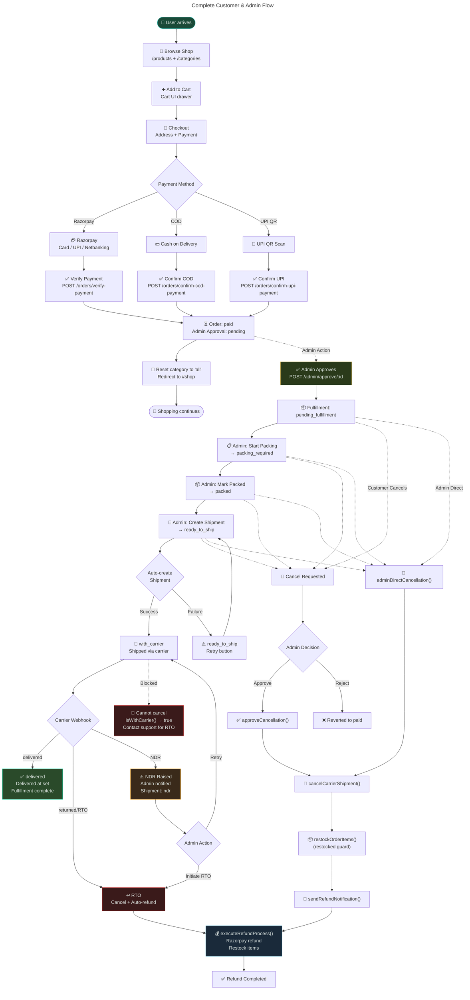
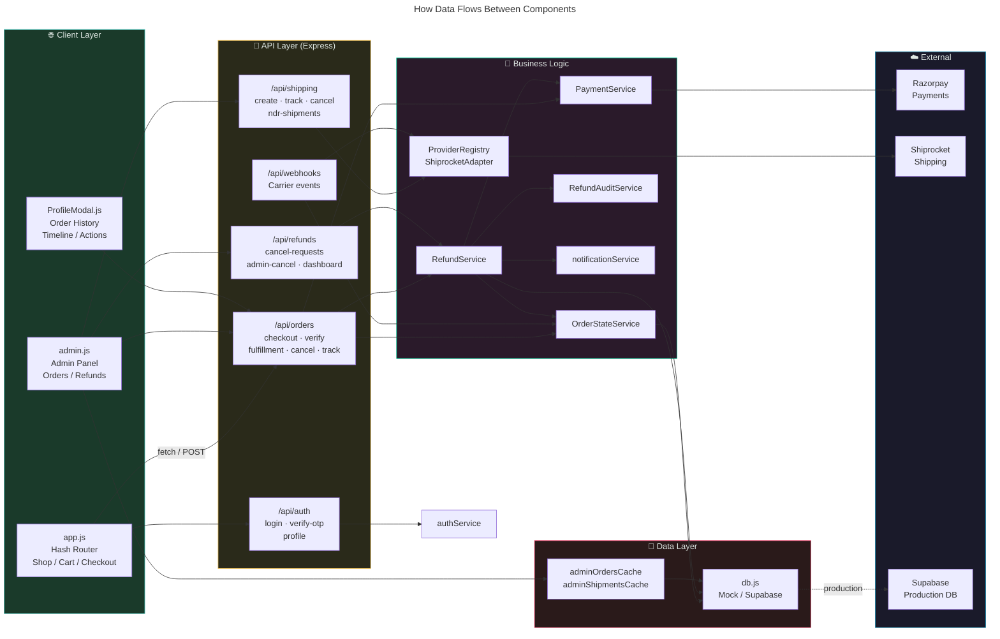
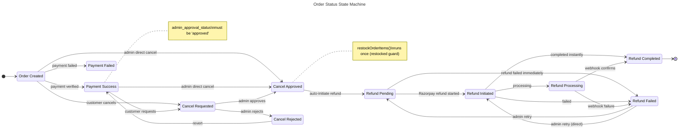
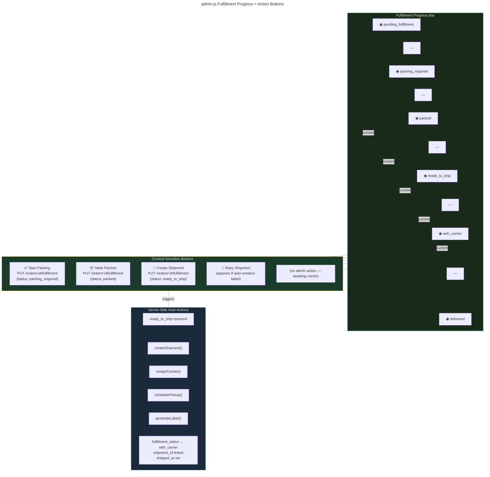
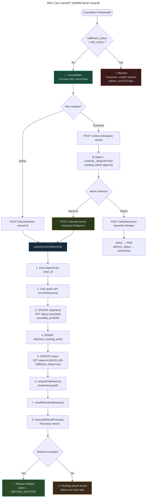
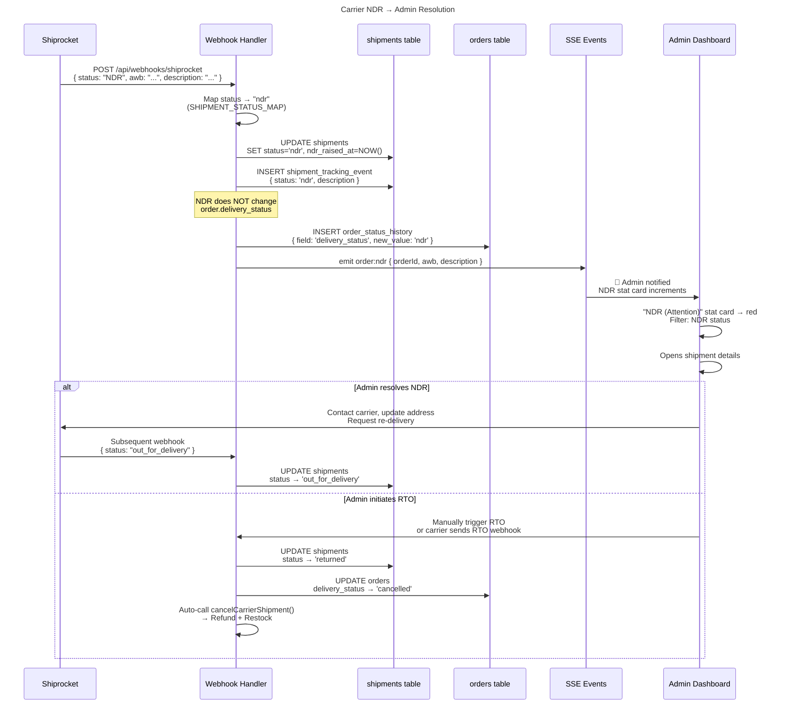

# 🍄 Sporekart — Visual Application Flow

> End-to-end user journey from browsing to delivery/cancellation  
> Last updated: June 29, 2026

---

## 👤 User Journey Overview



---

## 🧩 Component Interaction Map



---

## 🔁 State Transition Map



---

## 📦 Fulfillment Pipeline Detail



---

## 🚫 Cancellation Decision Tree



---

## 🌊 NDR (Non-Delivery Report) Flow



---

## 🧭 Customer Tracking Page

```mermaid
---
title: What the Customer Sees in #track
---
graph TB
    subgraph TRACKING_PAGE["Tracking Page Layout"]
        HEADER["Header: Order ID + Status Badge + Live/Simulated tag"]
        
        subgraph SUMMARY["Two-Column Summary"]
            PAYMENT_CARD["Payment Details\nMethod · Txn ID · Status\nRefund Status · Amount"]
            DELIVERY_CARD["Delivery Summary\nStage · Fulfillment Status\nShipped At · Delivered At"]
        end
        
        subgraph PROGRESS["Progress Section"]
            PCT_BAR["Progress Bar: 0-100%"]
            FULFILL_STRIP["Fulfillment Pipeline Strip\n(dot/connector visualization)"]
        end
        
        subgraph STATUS["Status Messages"]
            CANCEL_BOX["Cancellation Requested / Approved / Rejected"]
            REFUND_BOX["Refund Pending / Processing / Completed / Failed"]
            RTO_BOX["Returned to Sender (RTO) Alert"]
        end
        
        subgraph TIMELINE["Timeline"]
            CHECKPOINTS["Vertical Timeline\nOrder Placed → ... → Delivered/Cancelled"]
        end
        
        subgraph ACTIONS["Action Buttons"]
            INVOICE["Generate Tax Invoice"]
            WHATSAPP["Update via WhatsApp"]
            CANCEL_BTN["Cancel Order\n(shows only if cancellable)"]
        end
    end

    HEADER --> SUMMARY
    SUMMARY --> PROGRESS
    PROGRESS --> STATUS
    STATUS --> TIMELINE
    TIMELINE --> ACTIONS

    style TRACKING_PAGE fill:#1a2a1a,stroke:#4ecdc4,color:#e0e8e4
    style SUMMARY fill:#1a3a2a,stroke:#ffd166,color:#e0e8e4
    style PROGRESS fill:#1a3a2a,stroke:#06d6a0,color:#e0e8e4
    style STATUS fill:#2a1a2a,stroke:#ef476f,color:#e0e8e4
    style TIMELINE fill:#1a2a3a,stroke:#118ab2,color:#e0e8e4
```



---

## ⚙️ RefundService Internal Flow

```mermaid
---
title: executeRefundProcess() Internal Logic
---
flowchart TB
    START(["executeRefundProcess(order)"]) --> GUARD_RESTOCK{"order.restocked\n=== true ?"}
    
    GUARD_RESTOCK -->|Already restocked| SKIP_RESTOCK["⏭️ Skip restock\n(idempotent guard)"]
    GUARD_RESTOCK -->|Not restocked| DO_RESTOCK["📦 restockOrderItems()"]
    DO_RESTOCK --> SET_RESTOCKED["SET order.restocked = true"]
    
    SKIP_RESTOCK --> CREATE_REFUND["Create refund record\nstatus: pending"]
    SET_RESTOCKED --> CREATE_REFUND
    
    CREATE_REFUND --> GATEWAY{"Gateway refund\nsupported ?"}
    
    GATEWAY -->|Yes| RAZOR_CALL["Call Razorpay API\nPOST /payments/:id/refund\nwith idempotency key"]
    GATEWAY -->|No| MANUAL_FALLBACK["Set status: pending\nAdmin completes manually"]
    
    RAZOR_CALL --> REFUND_OK{"API success ?"}
    
    REFUND_OK -->|Yes| UPDATE_SUCCESS["Update order:\nrefund_status = initiated\nstatus = REFUND_INITIATED"]
    REFUND_OK -->|No| UPDATE_FAILED["Update refund:\nstatus = failed\nfailure_reason = error"]
    REFUND_OK -->|Error (network etc.)| PENDING_FALLBACK["Leave as REFUND_PENDING\nAdmin retries later"]
    
    UPDATE_SUCCESS --> AUDIT_LOG["RefundAuditService.log()\naction: REFUND_INITIATED"]
    AUDIT_LOG --> SSE["SSE: order:updated"]
    SSE --> DONE_Success(["✅ Done"])

    UPDATE_FAILED --> AUDIT_FAIL["RefundAuditService.log()\naction: REFUND_FAILED"]
    AUDIT_FAIL --> DONE_Fail(["❌ Done (failed)"])

    PENDING_FALLBACK --> AUDIT_PEND["RefundAuditService.log()\naction: REFUND_PENDING"]
    AUDIT_PEND --> DONE_Pend(["⏳ Done (pending)"])

    MANUAL_FALLBACK --> AUDIT_MANUAL["RefundAuditService.log()"]
    AUDIT_MANUAL --> DONE_Manual(["🔄 Done (manual)"])

    style GUARD_RESTOCK fill:#2a3a1a,stroke:#ffd166,color:#e0e8e4
    style RAZOR_CALL fill:#1a2a3a,stroke:#118ab2,color:#e0e8e4
    style UPDATE_SUCCESS fill:#2a4a2a,stroke:#06d6a0,color:#e0e8e4
    style UPDATE_FAILED fill:#3a1a1a,stroke:#ef4444,color:#e0e8e4
    style PENDING_FALLBACK fill:#3a2a1a,stroke:#f59e0b,color:#e0e8e4
```

---

> Generated from codebase analysis — All diagrams rendered with Mermaid.js  
> Open in any Mermaid-compatible markdown viewer (VS Code + Mermaid extension, GitHub, etc.)
