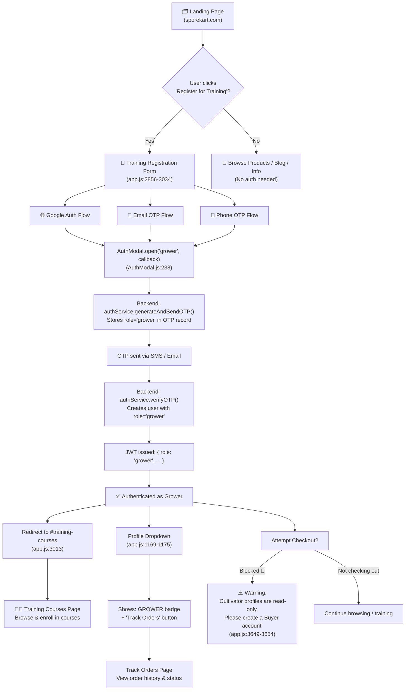
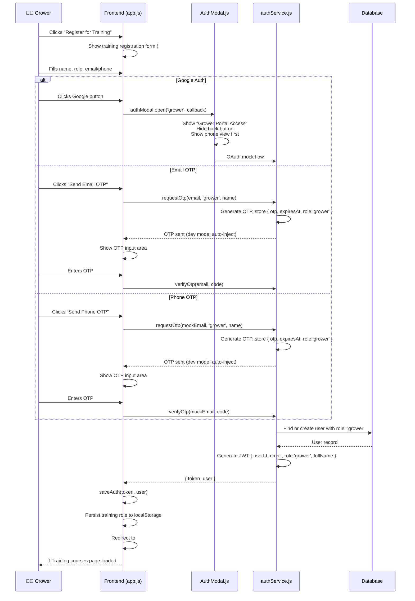
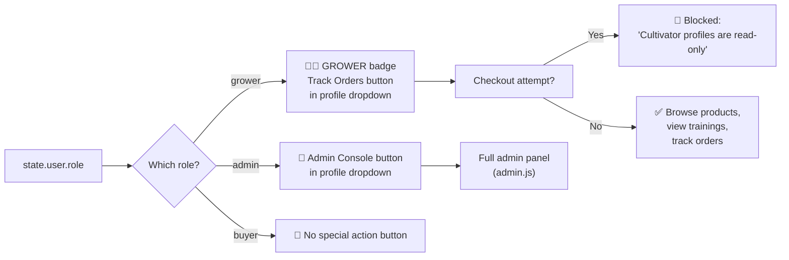
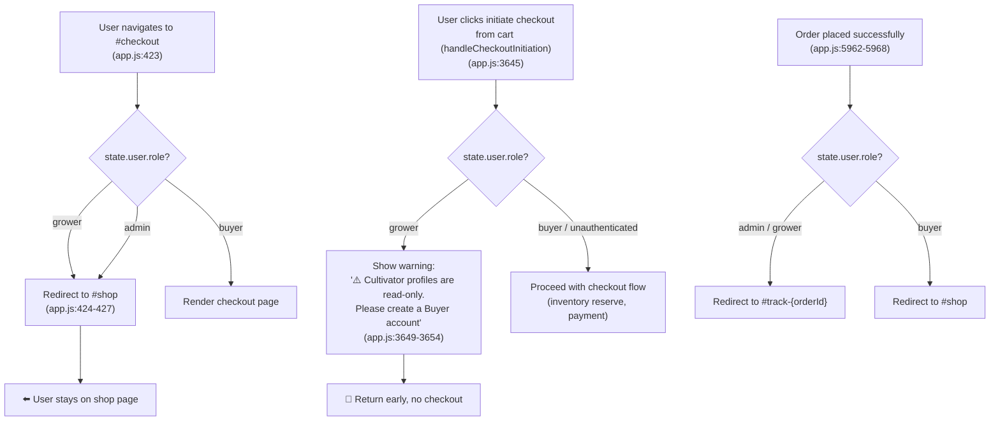
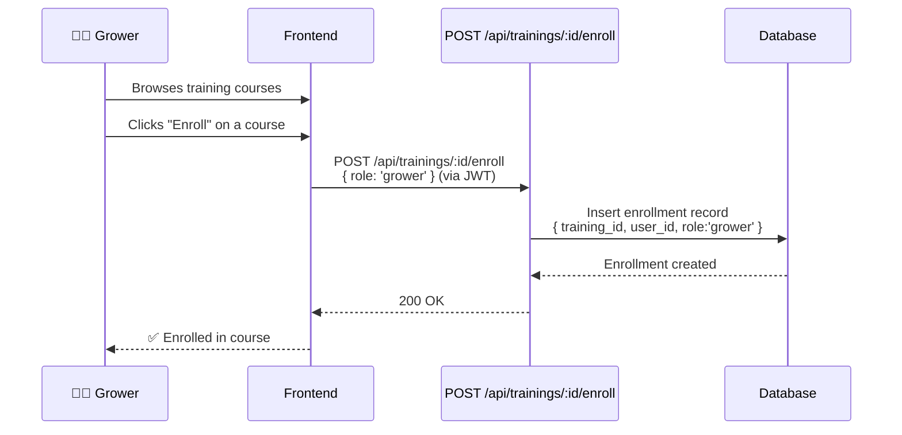

# Grower Admin Flow — Complete Reference

## Overview

The **Grower** role (`role: "grower"`) is a read-only customer identity designed for mushroom cultivators who access training courses, track orders, and browse products — but **cannot place orders** (blocked at checkout). Growers authenticate via OTP (email/phone) through the training registration flow.

---

## High-Level State Diagram



---

## End-to-End Flow: Registration & Authentication



---

## Role-Based UI Behavior



---

## Checkout Block Flow



---

## Training Enrollment Flow



---

## Auth Modal Behavior for Growers

| Feature | Buyer | Grower | Admin |
|---------|-------|--------|-------|
| Modal title | "Welcome to Sporekart" | "Grower Portal Access" | "Admin Portal Access" |
| Back button | Visible | **Hidden** | Depends |
| Name field | Visible | Visible | Visible |
| Default view | Phone | Phone | Password |
| Admin login link | Hidden | **Visible** | N/A |
| On success callback | Varies | Redirects to `#training-courses` | Admin panel |

---

## Seed Data

```
Grower login: grower@sporekart.com (OTP-based)
Name:         Sam Grower
Phone:        9876543212
Role:         grower
```

---

## File Reference

| File | What it does for grower |
|------|------------------------|
| `frontend/src/app.js:2856-3034` | Training registration form interactions, OTP request/verify |
| `frontend/src/app.js:2896` | Opens AuthModal with `role='grower'` on Google click |
| `frontend/src/app.js:2911` | Calls `requestOtp(email, 'grower', name)` |
| `frontend/src/app.js:424-427` | Blocks grower from checkout hash route |
| `frontend/src/app.js:1169-1175` | Shows GROWER badge + "Track Orders" in profile dropdown |
| `frontend/src/app.js:3649-3654` | Checkout initiation block with warning message |
| `frontend/src/app.js:5963-5968` | Post-order redirect to track page for grower |
| `frontend/src/components/AuthModal.js:238-301` | `open()` — grower-specific title, back button hidden, admin link shown |
| `backend/src/routes/trainings.js:38-66` | Enrollment route accepting `'grower'` role |
| `backend/src/controllers/authController.js:26,172` | Validates `"grower"` as a valid role |
| `backend/src/services/authService.js:43,148-155` | Stores & persists `role: "grower"` |
| `backend/src/config/db.js:803-811` | Seed data for grower user |
| `backend/src/config/seed.js:232-238` | Seed data for grower user |

---

## Summary

The grower role is an **authenticated read-only customer identity** primarily used for training course access. Key behaviors:

- **Authentication**: OTP-based (email/phone) via training registration form
- **Post-auth redirect**: `#training-courses`
- **Profile UI**: GROWER badge + Track Orders button (no Admin Console)
- **Checkout**: **Blocked** — growers see a warning and are redirected
- **Order tracking**: Available (same as buyer)
- **Training enrollment**: Available (role `'grower'` accepted)
- **No dedicated API routes** — grower shares buyer routes with role-based UI gating
